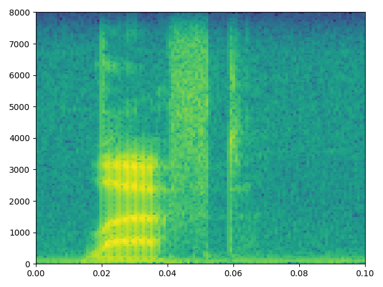

#读取wav文件

```python
from scipy.io import wavfile

#读取文件，返回采样频率和数据
#数据是一个numpy array,这个数组的元素如果是数组表示数据是一个多声道文件
rate, signal = wavfile.read(filename)
```
如果在程序中只需要声道的话可以使用取某一个声道
```python
if signal.ndim > 1:
    signal = signal[:,0] #0表示第一个声道
```
声音的时长
```python
second = len(signal) / rate
```
绘制某一段声音的图像
```python
import matplotlib.pyplot as plt
import numpy as np
...

start = 4000
end = 4500

#时域
plt.plot(np.arange(start=start, stop=stop), signal[start:stop])
#plt.savefig(filename, dpi=dpi) #保存图片
plt.show()
```

   
稍加处理   


保存声音波形图片
```python
gcf = plt.gcf()
dpi = 300
gcf.set_size_inches(width / dpi, height / dpi)
```

可以通过以下代码获取声谱图

```python
import scipy
import matplotlib.pyplot as plt

rate, signal = scipy.io.wavfile.read(filename)
if signal.ndim > 1:
    signal = signal[:, 0]

#plt.specgram(signal, Fs=rate, xextent=(0, len(signal))) #全部
plt.specgram(signal, Fs=rate, xextent=(0, 30)) #前30秒
plt.show()
```


获取文件fft特征并保存到文件
```python
def create_fft(filename):
   rate, signal = scipy.io.wavfile.read(filename)
   fft_feature = abs(scipy.fft(signal)[0:1000]) #保存fft成分前1000个
   base_filename, ext = io.path.splittext(filename)
   data_filename = base_filename + '.fft'
   np.save(data_filename, ffe_feature) # 文件扩展名为.npy
```
```python
np.load(filename) #加载fft特征文件
```

梅尔倒频系数 MFCC 特征
:pip install scikits.talkbox
:*安装失败* 

```python
from scikits.talkbox.features import mfcc

rate, signal = scipy.io.wavfile.read(filename)
ceps, mspec, spec = mfcc(signal)
base_filename, ext = os.path.splitext(filename)
data_filename = base_filename + ".ceps"
np.save(data_filename, ceps)
print(" Written %s" % data_filename)
```
转战librosa
:pip install librosa
```python
import librosa

y, sr = librosa.load(filename)
librosa.feature.melspectrogram(y=y, sr=sr)

D = np.abs(librosa.stft(y)) ** 2
S = librosa.feature.melspectrogram(S=D)

# Passing through arguments to the Mel filters
S = librosa.feature.melspectrogram(y=y, sr=sr, n_mels=128,
                                    fmax=8000)

import matplotlib.pyplot as plt
plt.figure(figsize=(10, 4))
#如果安装了librosa后没有display, 请修改安装目录下的__init__.py
#添加from . import display
librosa.display.specshow(librosa.power_to_db(S, ref=np.max),
                            y_axis='mel', fmax=8000,
                            x_axis='time')
plt.colorbar(format='%+2.0f dB')
plt.title('Mel spectrogram')
plt.tight_layout()
plt.show()
```


MFCC
```python
import librosa
import scipy
import matplotlib.pyplot as plt

rate, signal_data = scipy.io.wavfile.read(filename)
if signal_data.ndim > 1:
    signal = signal_data[:,0]
mfccs = librosa.feature.mfcc(y=signal_data, sr=rate, n_mfcc=40)
plt.figure(figsize=(10, 4))
librosa.display.specshow(mfccs, x_axis='time')
plt.colorbar()
plt.title('MFCC')
plt.tight_layout()
plt.show()
```

AFTE 特征
