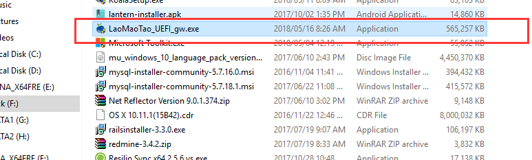
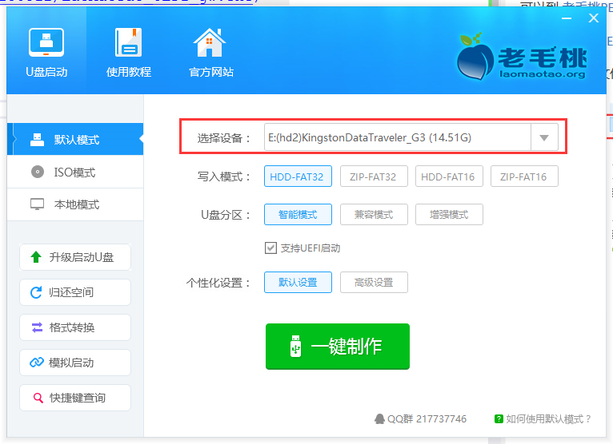
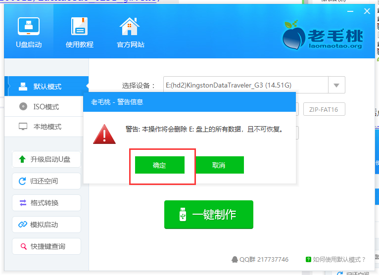
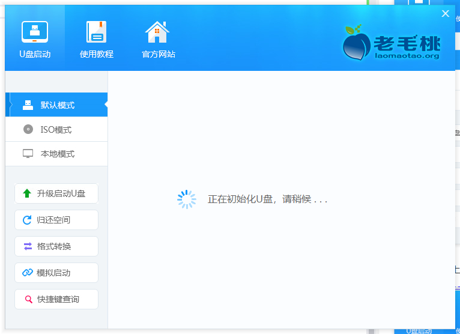
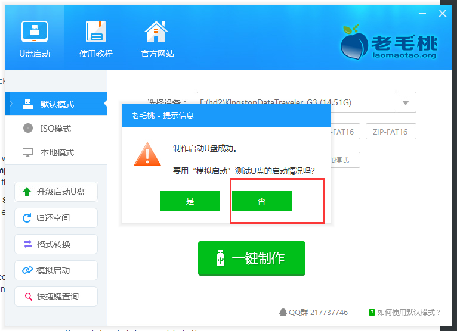

# 移除 window 登录密码

可以到 [老毛桃PE](http://www.laomaotao.org/)   
> [下载老毛桃PE](http://down.lmtxz1.com/20180512/LaoMaoTao_UEFI_gw.exe)   

双击下载好的文件

快速安装   
马上体检

选择优盘，之后点击一键制作

点击确定(优盘上有用的东西先拷出来)

等待

不用测试

